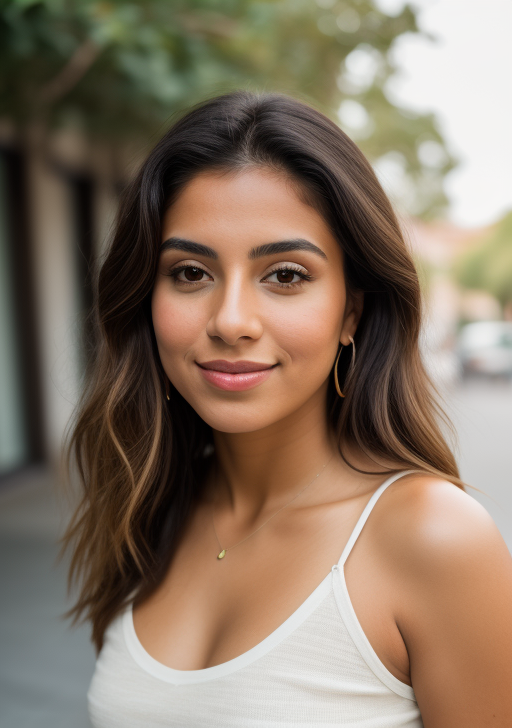

# SG161222/Realistic_Vision_V5.1_noVAE Cog model

This is an implementation of the [SG161222/Realistic_Vision_V5.1_noVAE](https://huggingface.co/SG161222/Realistic_Vision_V5.1_noVAE) as a Cog model. [Cog packages machine learning models as standard containers.](https://github.com/replicate/cog)

First, download the pre-trained weights:

    cog run script/download-weights

Then, you can run predictions:

    cog predict -i prompt="RAW photo, a portrait photo of a latina woman in casual clothes, natural skin, 8k uhd, high quality, film grain, Fujifilm XT3" -i seed=1339

## Example

Output:

